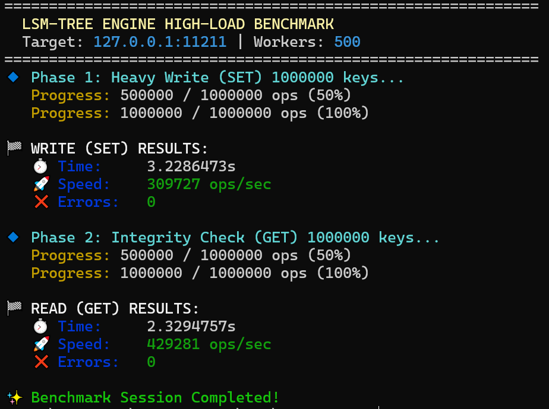

# High-Performance LSM-Tree Key-Value Store



A high-performance, persistent Key-Value storage engine based on **Log-Structured Merge-tree (LSM-Tree)** architecture. This engine is designed for high-throughput write environments and features a Memcached-compatible protocol.

## 🚀 Performance Highlights

The engine has been benchmarked under heavy concurrent load (500 parallel workers) on both virtualized and bare-metal environments.

| Environment | Operations | Throughput (OPS/sec) | Error Rate |
| :--- | :--- | :--- | :--- |
| **Bare Metal (Host)** | **Read (GET)** | **~452,000** | **0%** |
| **Bare Metal (Host)** | **Write (SET)** | **~371,000** | **0%** |


---

## 🏗 Architecture & Features

### 1. Storage Design
* **MemTable:** In-memory storage using a fast **SkipList** implementation for $O(\log N)$ operations.
* **SSTable (Sorted String Table):** Efficient on-disk format with a **Sparse Index** to minimize disk I/O during lookups.
* **Buffered I/O:** Utilizes advanced `bufio` clustering to reduce system call overhead, allowing the engine to saturate SSD bandwidth.
* **Sparse Indexing:** Loads only necessary keys into memory, keeping the memory footprint low even with millions of records.

### 2. Networking
* **Protocol:** Fully compatible with the **Memcached Text Protocol**.
* **Concurrency:** High-performance TCP server using Go's native goroutine-per-connection model, optimized to handle high connection backlogs.


### 3. Key Optimizations
* **Zero-Seek Writes:** SSTables are written sequentially. Offsets are calculated in-memory during the flush process, eliminating expensive `File.Seek` calls during write-heavy workloads.
* **Binary Packing:** Uses `BigEndian` encoding for consistent cross-platform data storage.
* **Batch Flushing:** Implements a sophisticated flushing mechanism that clears the MemTable and generates the Sparse Index in a single pass.

---

## ⚠️ Disclaimer: Educational Project

This project was developed for **educational and research purposes** to explore the internals of LSM-tree architectures and high-performance networking in Go.

Please note the following:
* **Not Production Ready:** This storage engine has **not** been tested in a production environment. It lacks critical production features such as a **Write-Ahead Log (WAL)** for crash recovery, comprehensive unit test coverage for edge cases, and automated **SSTable Compaction**.
* **Experimental Nature:** The focus was on achieving maximum throughput and understanding I/O bottlenecks rather than ensuring long-term data durability or security.
* **No Warranty:** This is a "hobbyist" project. Use it at your own risk in any environment outside of local benchmarking.

*This project is a testament to my interest in systems programming and my journey into building high-load distributed systems.*

---

## 🛠 Getting Started

### Prerequisites
* Go 1.21+
* Any Memcached client (or use the built-in benchmark tool)

### Running the Server
```bash
go run cmd/server/main.go
```

---

## 📄 Author and License

**Author**: Mikhail Chuloshnikov

**License**: MIT License

This project is released under the MIT License. See the [LICENSE](LICENSE) file for more details.